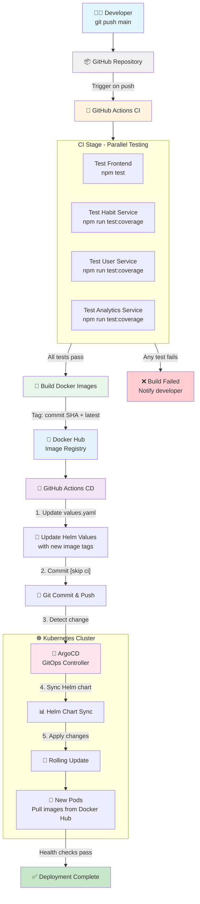

# CI/CD Pipeline

This diagram shows the complete CI/CD pipeline from code commit to production deployment.

## Pipeline Stages

### 1. CI Stage (GitHub Actions)
- **Trigger:** Push to main branch or Pull Request
- **Jobs:** Test all 4 services in parallel
- **On Success:** Build and push Docker images
- **Duration:** ~5-7 minutes

### 2. CD Stage (GitHub Actions)
- **Trigger:** After CI completes successfully
- **Actions:**
  - Update `values.yaml` with new image tags (commit SHA)
  - Commit changes with `[skip ci]` flag
  - Push to Git repository
- **Duration:** ~1-2 minutes

### 3. GitOps Stage (ArgoCD)
- **Trigger:** Detects Git repository changes (polls every 3 minutes)
- **Actions:**
  - Pull latest Helm chart from Git
  - Compare with current cluster state
  - Apply changes to Kubernetes
- **Duration:** ~3-5 minutes

### 4. Deployment Stage (Kubernetes)
- **Process:** Rolling update (zero downtime)
- **Steps:**
  1. Pull new images from Docker Hub
  2. Start new pods
  3. Wait for health checks to pass
  4. Terminate old pods
- **Duration:** ~30-60 seconds

## Total Time
**Code push to production:** ~10-15 minutes

## Rollback Strategy
- **Git-based:** Revert commit in Git, ArgoCD auto-syncs
- **ArgoCD:** Rollback to previous revision via UI/CLI
- **Kubernetes:** `kubectl rollout undo` (emergency only)

