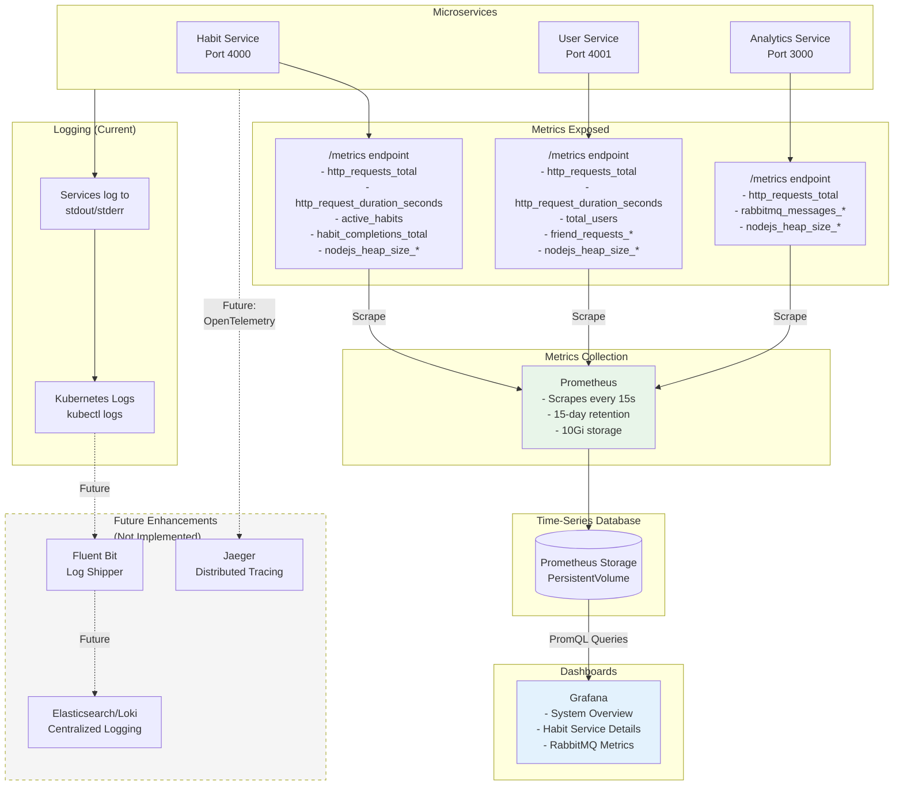

# Monitoring and Observability Architecture

This diagram shows how metrics are collected, stored, and visualized.



## Metrics Collection

### Services Instrumentation
Each service exposes a `/metrics` endpoint in Prometheus format using `prom-client` library:

```javascript
// monitoring/metrics.js
import client from 'prom-client'

// Default metrics (CPU, memory, event loop)
client.collectDefaultMetrics({ register })

// Custom HTTP metrics
export const httpRequestsTotal = new client.Counter({
  name: 'http_requests_total',
  labelNames: ['method', 'endpoint', 'status', 'service']
})

// Business metrics
export const habitCompletionsTotal = new client.Counter({
  name: 'habit_completions_total',
  labelNames: ['service']
})
```

### Prometheus Configuration
```yaml
scrape_configs:
  - job_name: 'habit-service'
    static_configs:
      - targets: ['habit-service:4000']
    scrape_interval: 15s

  - job_name: 'user-service'
    static_configs:
      - targets: ['user-service:4001']
    scrape_interval: 15s

  - job_name: 'analytics-service'
    static_configs:
      - targets: ['habit-analytics:3000']
    scrape_interval: 15s
```

## Collected Metrics

### Default Node.js Metrics
- `nodejs_heap_size_used_bytes` - Memory usage
- `nodejs_eventloop_lag_seconds` - Event loop performance
- `process_cpu_user_seconds_total` - CPU time

### HTTP Metrics
- `http_requests_total` - Request count by endpoint, method, status
- `http_request_duration_seconds` - Request latency histogram

### Business Metrics
- `active_habits` - Current active habits count
- `habit_completions_total` - Total habit completions
- `total_users` - Total registered users
- `friend_requests_sent_total` - Friend requests sent
- `friend_requests_accepted_total` - Friend requests accepted

### RabbitMQ Metrics
- `rabbitmq_messages_published_total` - Messages published
- `rabbitmq_messages_failed_total` - Failed publishes

## Grafana Dashboards

### 1. System Overview Dashboard
- Request rate (QPS) across all services
- Error rate (%) by service
- P95 response time
- Memory and CPU usage
- Event loop lag

### 2. Habit Service Dashboard
- Active habits gauge
- Habit completion rate
- Requests by endpoint
- Response time by endpoint

### 3. RabbitMQ Dashboard
- Message publish rate by routing key
- Message failure rate
- Queue depth (future)

## Logging

### Current Implementation
- **Stdout/Stderr:** All services log to console
- **Kubernetes:** Captures logs automatically
- **Access:** `kubectl logs -f deployment/habit-service -n habit-dev`

### Future Enhancements (Not Implemented)
- **Structured Logging:** JSON format with Winston/Pino
- **Centralized:** Fluent Bit → Elasticsearch/Loki
- **Visualization:** Kibana or Grafana for log exploration

## Distributed Tracing

### Current Limitation
No distributed tracing implemented - cannot trace requests across multiple services.

### Proposed Solution (Not Implemented)
- **OpenTelemetry SDK** - Instrument services
- **Jaeger** - Collect and visualize traces
- **Benefit** - End-to-end request visibility

## Access Monitoring

### Grafana UI
```bash
kubectl port-forward -n habit-dev svc/habit-tracker-grafana 3000:3000
# Open http://localhost:3000
```

### Prometheus UI
```bash
kubectl port-forward -n habit-dev svc/habit-tracker-prometheus 9090:9090
# Open http://localhost:9090
```

## Key PromQL Queries

```promql
# Request rate (QPS)
sum(rate(http_requests_total[5m])) by (service)

# Error rate (%)
sum(rate(http_requests_total{status=~"5.."}[5m])) 
  / sum(rate(http_requests_total[5m])) * 100

# P95 response time
histogram_quantile(0.95, 
  sum(rate(http_request_duration_seconds_bucket[5m])) by (le, service)
)
```

