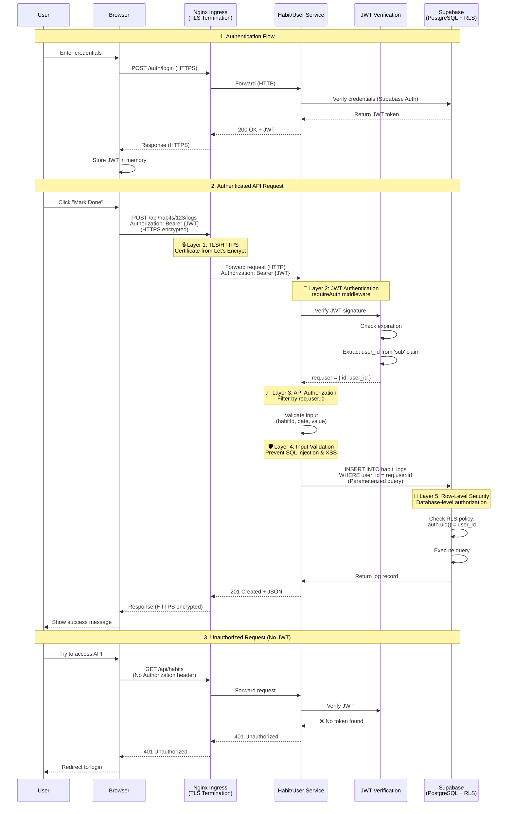

# Security Model and Request Flow

This diagram shows the security layers and request flow for authenticated API requests.

## Security Layers

### Layer 1: TLS/HTTPS Encryption
- **Technology:** cert-manager + Let's Encrypt
- **What it protects:** All data in transit
- **Location:** Nginx Ingress (TLS termination)

### Layer 2: JWT Authentication
- **Technology:** Supabase Auth + jsonwebtoken
- **What it protects:** Ensures user identity
- **Middleware:** `requireAuth` in `auth/authMiddleware.js`

### Layer 3: API Authorization
- **Implementation:** User ID extracted from JWT
- **What it protects:** Queries filtered by `req.user.id`
- **Example:** `WHERE user_id = req.user.id`

### Layer 4: Input Validation
- **Protection against:**
  - SQL Injection (parameterized queries)
  - XSS (React auto-escaping, Helmet.js headers)
  - Invalid data (server-side validation)

### Layer 5: Row-Level Security (RLS)
- **Technology:** PostgreSQL RLS policies
- **What it protects:** Defense in depth at database level
- **Example:** `USING (auth.uid() = user_id)`

## Security Best Practices Implemented

✅ **HTTPS Everywhere** - All external traffic encrypted  
✅ **JWT Authentication** - Stateless, scalable authentication  
✅ **Row-Level Security** - Database-level authorization  
✅ **Input Validation** - Server-side validation of all inputs  
✅ **SQL Injection Protection** - Parameterized queries only  
✅ **XSS Protection** - React auto-escaping + Helmet.js  
✅ **Secrets Management** - No secrets in Git  
✅ **Defense in Depth** - Multiple security layers  

## Request Flow Summary

1. **User authenticates** → Receives JWT token
2. **Browser includes JWT** in Authorization header (HTTPS)
3. **Nginx Ingress terminates TLS** → Forwards to service (HTTP internal)
4. **Service verifies JWT** → Extracts user_id
5. **Service validates input** → Prevents injection attacks
6. **Database checks RLS** → Ensures data isolation
7. **Response encrypted** → Returns via HTTPS to browser

