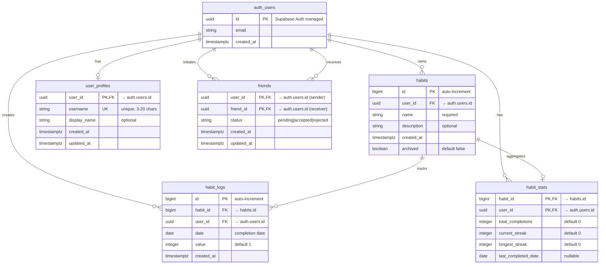

# REQ9 – Documented Database Schema

## Overview

This document provides comprehensive documentation of the Habit Tracker database schema, including an Entity-Relationship Diagram (ERD) and detailed table specifications. The database is hosted on **Supabase (PostgreSQL)** and implements Row-Level Security (RLS) for data protection.

---

## Entity-Relationship Diagram (ERD)



---

## Table Specifications

### 1. auth.users (Supabase Auth)

**Purpose:** Manages user authentication and identity.

| Column | Type | Constraints | Description |
|--------|------|-------------|-------------|
| id | uuid | PRIMARY KEY | Unique user identifier |
| email | text | UNIQUE, NOT NULL | User's email address |
| encrypted_password | text | NOT NULL | Hashed password |
| created_at | timestamptz | DEFAULT now() | Account creation timestamp |
| ... | ... | ... | Additional Supabase Auth fields |

**Notes:**
- Managed entirely by Supabase Auth
- All application tables reference `auth.users.id` as the user identifier
- No separate `public.users` table is maintained

---

### 2. user_profiles

**Purpose:** Stores user profile information including unique usernames for friend discovery.

| Column | Type | Constraints | Description |
|--------|------|-------------|-------------|
| user_id | uuid | PRIMARY KEY, FK → auth.users.id | User identifier |
| username | text | UNIQUE, NOT NULL | Unique username (3-20 chars) |
| display_name | text | NULL | Optional display name |
| created_at | timestamptz | DEFAULT now() | Profile creation timestamp |
| updated_at | timestamptz | DEFAULT now() | Last update timestamp |

**Constraints:**
- `user_id` → `auth.users.id` ON DELETE CASCADE
- Unique index on `username`

**Username Rules:**
- 3-20 characters
- Lowercase alphanumeric, underscores, hyphens only
- Pattern: `^[a-z0-9_-]{3,20}$`

**Triggers:**
- `update_updated_at_column` - Automatically updates `updated_at` on row modification

---

### 3. habits

**Purpose:** Represents individual habits that users want to track.

| Column | Type | Constraints | Description |
|--------|------|-------------|-------------|
| id | bigint | PRIMARY KEY, SERIAL | Auto-incrementing habit ID |
| user_id | uuid | FK → auth.users.id, NOT NULL | Habit owner |
| name | text | NOT NULL | Habit name/title |
| description | text | NULL | Optional description |
| created_at | timestamptz | DEFAULT now() | Creation timestamp |
| archived | boolean | DEFAULT false | Soft delete flag |

**Constraints:**
- `user_id` → `auth.users.id` ON DELETE CASCADE

**Indexes:**
- Primary key on `id`
- Index on `user_id` (implicit from FK)

---

### 4. habit_logs

**Purpose:** Records individual habit completions (check-ins) for specific dates.

| Column | Type | Constraints | Description |
|--------|------|-------------|-------------|
| id | bigint | PRIMARY KEY, SERIAL | Auto-incrementing log ID |
| habit_id | bigint | FK → habits.id, NOT NULL | Associated habit |
| user_id | uuid | FK → auth.users.id, NOT NULL | Log owner |
| date | date | NOT NULL | Completion date (YYYY-MM-DD) |
| value | integer | NOT NULL, DEFAULT 1 | Completion value/count |
| created_at | timestamptz | DEFAULT now() | Log creation timestamp |

**Constraints:**
- `habit_id` → `habits.id` ON DELETE CASCADE
- `user_id` → `auth.users.id` ON DELETE CASCADE
- **UNIQUE (habit_id, date)** - Prevents duplicate logs for same habit/day

**Indexes:**
- Primary key on `id`
- Unique index on `(habit_id, date)`

**Anti-Spam Protection:**
The unique constraint on `(habit_id, date)` prevents users from logging the same habit multiple times on the same day.

---

### 5. habit_stats

**Purpose:** Stores aggregated analytics for each habit, updated by the analytics service.

| Column | Type | Constraints | Description |
|--------|------|-------------|-------------|
| habit_id | bigint | PRIMARY KEY, FK → habits.id | Associated habit |
| user_id | uuid | PRIMARY KEY, FK → auth.users.id | Stats owner |
| total_completions | integer | NOT NULL, DEFAULT 0 | Total times completed |
| current_streak | integer | NOT NULL, DEFAULT 0 | Current consecutive days |
| longest_streak | integer | NOT NULL, DEFAULT 0 | Longest streak ever |
| last_completed_date | date | NULL | Most recent completion date |

**Constraints:**
- Composite primary key: `(habit_id, user_id)`
- `habit_id` → `habits.id` ON DELETE CASCADE
- `user_id` → `auth.users.id` ON DELETE CASCADE

**Updated By:**
- Analytics service via RabbitMQ event consumption
- Processes `habit.completed` events

---

### 6. friends

**Purpose:** Manages friend relationships with request/acceptance flow.

| Column | Type | Constraints | Description |
|--------|------|-------------|-------------|
| user_id | uuid | PRIMARY KEY, FK → auth.users.id | Request sender |
| friend_id | uuid | PRIMARY KEY, FK → auth.users.id | Request receiver |
| status | text | NOT NULL, CHECK constraint | pending, accepted, or rejected |
| created_at | timestamptz | DEFAULT now() | Request creation timestamp |
| updated_at | timestamptz | DEFAULT now() | Last status update timestamp |

**Constraints:**
- Composite primary key: `(user_id, friend_id)`
- `user_id` → `auth.users.id` ON DELETE CASCADE
- `friend_id` → `auth.users.id` ON DELETE CASCADE
- CHECK: `status IN ('pending', 'accepted', 'rejected')`

**Indexes:**
- Composite primary key on `(user_id, friend_id)`
- Index on `user_id`
- Index on `friend_id`
- Index on `status`

**Friend Request Flow:**
1. User A sends request to User B → status = `pending`
2. User B accepts → status = `accepted`
3. User B rejects → status = `rejected`

**Triggers:**
- `update_updated_at_column` - Automatically updates `updated_at` on row modification

---

## Realtime Configuration

Supabase Realtime is enabled for the following tables to support live updates in the frontend:

- **habit_logs** - Real-time habit completion notifications
- **habit_stats** - Live streak and statistics updates

**Security:** Realtime subscriptions respect Row-Level Security (RLS) policies. Users can only receive updates for data they have permission to access.

---

## Data Relationships Summary

### User → Habits (One-to-Many)
- Each user can create multiple habits
- Habits are owned by exactly one user
- Cascade delete: Deleting a user removes all their habits

### Habit → Habit Logs (One-to-Many)
- Each habit can have multiple completion logs
- Each log belongs to exactly one habit
- Cascade delete: Deleting a habit removes all its logs

### Habit → Habit Stats (One-to-One)
- Each habit has one stats record per user
- Stats are automatically maintained by analytics service
- Cascade delete: Deleting a habit removes its stats

### User → User Profile (One-to-One)
- Each user has at most one profile
- Profile is required for friend features
- Cascade delete: Deleting a user removes their profile

### User → Friends (Many-to-Many)
- Users can have multiple friends
- Friendship is directional (sender/receiver)
- Status tracks request state
- Cascade delete: Deleting a user removes all their friendships

---

## Database Creation Scripts

### Complete Schema SQL

```sql
-- User Profiles Table
CREATE TABLE IF NOT EXISTS public.user_profiles (
  user_id uuid PRIMARY KEY REFERENCES auth.users(id) ON DELETE CASCADE,
  username text UNIQUE NOT NULL,
  display_name text,
  created_at timestamptz DEFAULT now(),
  updated_at timestamptz DEFAULT now()
);

-- Habits Table
CREATE TABLE IF NOT EXISTS public.habits (
  id bigserial PRIMARY KEY,
  user_id uuid NOT NULL REFERENCES auth.users(id) ON DELETE CASCADE,
  name text NOT NULL,
  description text,
  created_at timestamptz DEFAULT now(),
  archived boolean DEFAULT false
);

-- Habit Logs Table
CREATE TABLE IF NOT EXISTS public.habit_logs (
  id bigserial PRIMARY KEY,
  habit_id bigint NOT NULL REFERENCES public.habits(id) ON DELETE CASCADE,
  user_id uuid NOT NULL REFERENCES auth.users(id) ON DELETE CASCADE,
  date date NOT NULL,
  value integer NOT NULL DEFAULT 1,
  created_at timestamptz DEFAULT now(),
  UNIQUE (habit_id, date)
);

-- Habit Stats Table
CREATE TABLE IF NOT EXISTS public.habit_stats (
  habit_id bigint REFERENCES public.habits(id) ON DELETE CASCADE,
  user_id uuid REFERENCES auth.users(id) ON DELETE CASCADE,
  total_completions integer NOT NULL DEFAULT 0,
  current_streak integer NOT NULL DEFAULT 0,
  longest_streak integer NOT NULL DEFAULT 0,
  last_completed_date date,
  PRIMARY KEY (habit_id, user_id)
);

-- Friends Table
CREATE TABLE IF NOT EXISTS public.friends (
  user_id uuid REFERENCES auth.users(id) ON DELETE CASCADE,
  friend_id uuid REFERENCES auth.users(id) ON DELETE CASCADE,
  status text NOT NULL DEFAULT 'pending' CHECK (status IN ('pending', 'accepted', 'rejected')),
  created_at timestamptz DEFAULT now(),
  updated_at timestamptz DEFAULT now(),
  PRIMARY KEY (user_id, friend_id)
);

-- Indexes
CREATE INDEX IF NOT EXISTS idx_friends_user_id ON public.friends(user_id);
CREATE INDEX IF NOT EXISTS idx_friends_friend_id ON public.friends(friend_id);
CREATE INDEX IF NOT EXISTS idx_friends_status ON public.friends(status);

-- Trigger Function for updated_at
CREATE OR REPLACE FUNCTION update_updated_at_column()
RETURNS TRIGGER AS $$
BEGIN
  NEW.updated_at = now();
  RETURN NEW;
END;
$$ LANGUAGE plpgsql;

-- Apply Triggers
CREATE TRIGGER update_user_profiles_updated_at
  BEFORE UPDATE ON public.user_profiles
  FOR EACH ROW
  EXECUTE FUNCTION update_updated_at_column();

CREATE TRIGGER update_friends_updated_at
  BEFORE UPDATE ON public.friends
  FOR EACH ROW
  EXECUTE FUNCTION update_updated_at_column();
```

---

## Row-Level Security (RLS)

All tables have RLS enabled. See `supabase/rls-policies.sql` and `docs/security.md` for complete policy definitions.

**Key Principles:**
- Users can only access their own data
- Friends can view each other's friendship records
- Leaderboard queries are restricted to accepted friends
- Service role key bypasses RLS for backend operations

---

## References

- **Detailed RLS Policies:** `supabase/rls-policies.sql`
- **Security Documentation:** `docs/security.md`
- **API Documentation:** `habit-service/openapi.yaml`, `user-service/openapi.yaml`

---

**Document Version:** 1.0  
**Last Updated:** December 20, 2025  
**Status:** ✅ Complete - Schema exists in Supabase and is fully documented

