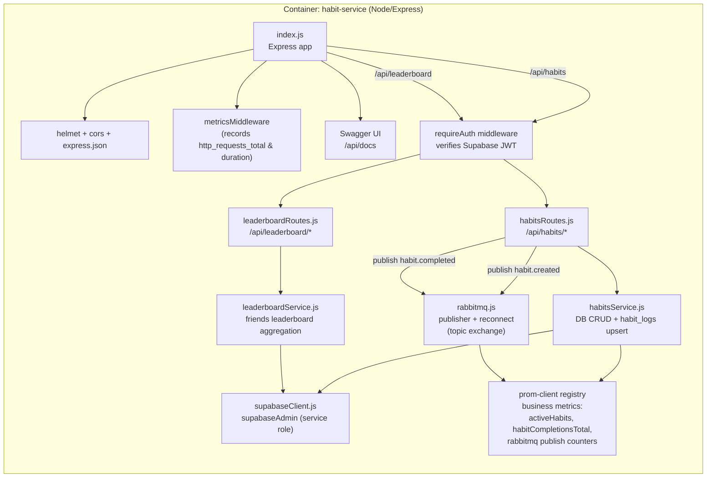

```mermaid
flowchart LR
  subgraph HabitService["Container: habit-service (Node/Express)"]
    index["index.js<br/>Express app"]
    helmet["helmet + cors + express.json"]
    metricsMW["metricsMiddleware<br/>(records http_requests_total & duration)"]
    openapi["Swagger UI<br/>/api/docs"]

    authMW["requireAuth middleware<br/>verifies Supabase JWT"]
    habitsRoutes["habitsRoutes.js<br/>/api/habits/*"]
    leaderboardRoutes["leaderboardRoutes.js<br/>/api/leaderboard/*"]

    habitsSvc["habitsService.js<br/>DB CRUD + habit_logs upsert"]
    leaderboardSvc["leaderboardService.js<br/>friends leaderboard aggregation"]

    supaClient["supabaseClient.js<br/>supabaseAdmin (service role)"]
    rabbitPub["rabbitmq.js<br/>publisher + reconnect<br/>(topic exchange)"]

    promMetrics["prom-client registry<br/>business metrics:<br/>activeHabits, habitCompletionsTotal,<br/>rabbitmq publish counters"]
  end

  index --> helmet
  index --> metricsMW
  index --> openapi

  index -->|/api/habits| authMW --> habitsRoutes --> habitsSvc --> supaClient
  index -->|/api/leaderboard| authMW --> leaderboardRoutes --> leaderboardSvc --> supaClient

  habitsRoutes -->|publish habit.created| rabbitPub
  habitsRoutes -->|publish habit.completed| rabbitPub

  habitsSvc --> promMetrics
  rabbitPub --> promMetrics
```