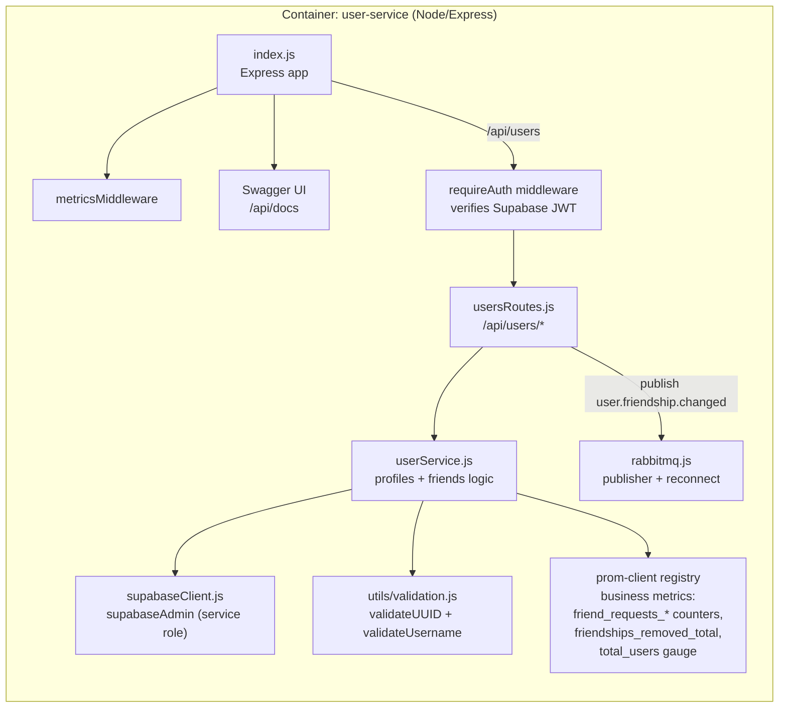

```mermaid
flowchart LR
  subgraph UserService["Container: user-service (Node/Express)"]
    index["index.js<br/>Express app"]
    metricsMW["metricsMiddleware"]
    openapi["Swagger UI<br/>/api/docs"]
    authMW["requireAuth middleware<br/>verifies Supabase JWT"]
    usersRoutes["usersRoutes.js<br/>/api/users/*"]
    userSvc["userService.js<br/>profiles + friends logic"]
    validation["utils/validation.js<br/>validateUUID + validateUsername"]
    supaClient["supabaseClient.js<br/>supabaseAdmin (service role)"]
    rabbitPub["rabbitmq.js<br/>publisher + reconnect"]
    promMetrics["prom-client registry<br/>business metrics:<br/>friend_requests_* counters,<br/>friendships_removed_total,<br/>total_users gauge"]
  end

  index --> metricsMW
  index --> openapi

  index -->|/api/users| authMW --> usersRoutes --> userSvc --> supaClient
  userSvc --> validation

  usersRoutes -->|publish user.friendship.changed| rabbitPub
  userSvc --> promMetrics
```