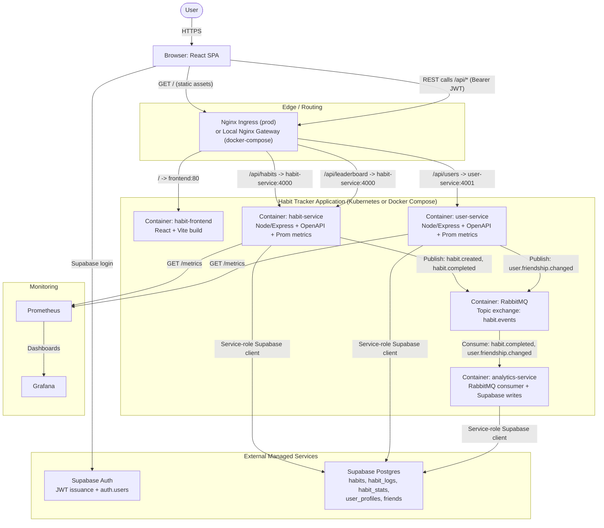

```mermaid
flowchart TB
  user(["User"]) -->|"HTTPS"| browser["Browser: React SPA"]

  subgraph Edge["Edge / Routing"]
    ingress["Nginx Ingress (prod)<br/>or Local Nginx Gateway (docker-compose)"]
  end

  browser -->|"GET / (static assets)"| ingress
  browser -->|"REST calls /api/* (Bearer JWT)"| ingress

  subgraph App["Habit Tracker Application (Kubernetes or Docker Compose)"]
    frontend["Container: habit-frontend<br/>React + Vite build"]
    habitSvc["Container: habit-service<br/>Node/Express + OpenAPI + Prom metrics"]
    userSvc["Container: user-service<br/>Node/Express + OpenAPI + Prom metrics"]
    analytics["Container: analytics-service<br/>RabbitMQ consumer + Supabase writes"]
    rabbit["Container: RabbitMQ<br/>Topic exchange: habit.events"]
  end

  ingress -->|"/ -> frontend:80"| frontend
  ingress -->|"/api/habits -> habit-service:4000"| habitSvc
  ingress -->|"/api/leaderboard -> habit-service:4000"| habitSvc
  ingress -->|"/api/users -> user-service:4001"| userSvc

  habitSvc -->|"Publish: habit.created, habit.completed"| rabbit
  userSvc -->|"Publish: user.friendship.changed"| rabbit
  rabbit -->|"Consume: habit.completed, user.friendship.changed"| analytics

  subgraph Data["External Managed Services"]
    supaAuth["Supabase Auth<br/>JWT issuance + auth.users"]
    supaDB["Supabase Postgres<br/>habits, habit_logs, habit_stats,<br/>user_profiles, friends"]
  end

  browser -->|"Supabase login"| supaAuth
  habitSvc -->|"Service-role Supabase client"| supaDB
  userSvc -->|"Service-role Supabase client"| supaDB
  analytics -->|"Service-role Supabase client"| supaDB

  subgraph Observability["Monitoring"]
    prom["Prometheus"]
    grafana["Grafana"]
  end

  habitSvc -->|"GET /metrics"| prom
  userSvc -->|"GET /metrics"| prom
  prom -->|"Dashboards"| grafana
```