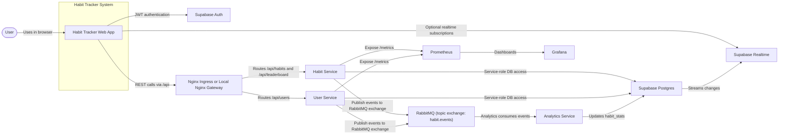

```mermaid
flowchart LR
  user(["User"]) -->|"Uses in browser"| web["Habit Tracker Web App"]

  subgraph HabitTracker["Habit Tracker System"]
    web
  end

  web -->|"JWT authentication"| supaAuth["Supabase Auth"]
  web -->|"REST calls via /api"| gateway["Nginx Ingress or Local Nginx Gateway"]

  gateway -->|"Routes /api/habits and /api/leaderboard"| habitSvc["Habit Service"]
  gateway -->|"Routes /api/users"| userSvc["User Service"]

  habitSvc -->|"Service-role DB access"| supaDB["Supabase Postgres"]
  userSvc -->|"Service-role DB access"| supaDB

  habitSvc -->|"Publish events to RabbitMQ exchange"| rabbit["RabbitMQ (topic exchange: habit.events)"]
  userSvc -->|"Publish events to RabbitMQ exchange"| rabbit

  rabbit -->|"Analytics consumes events"| analytics["Analytics Service"]
  analytics -->|"Updates habit_stats"| supaDB

  habitSvc -->|"Expose /metrics"| prom["Prometheus"]
  userSvc -->|"Expose /metrics"| prom
  prom -->|"Dashboards"| grafana["Grafana"]

  web -->|"Optional realtime subscriptions"| supaRT["Supabase Realtime"]
  supaDB -->|"Streams changes"| supaRT
```